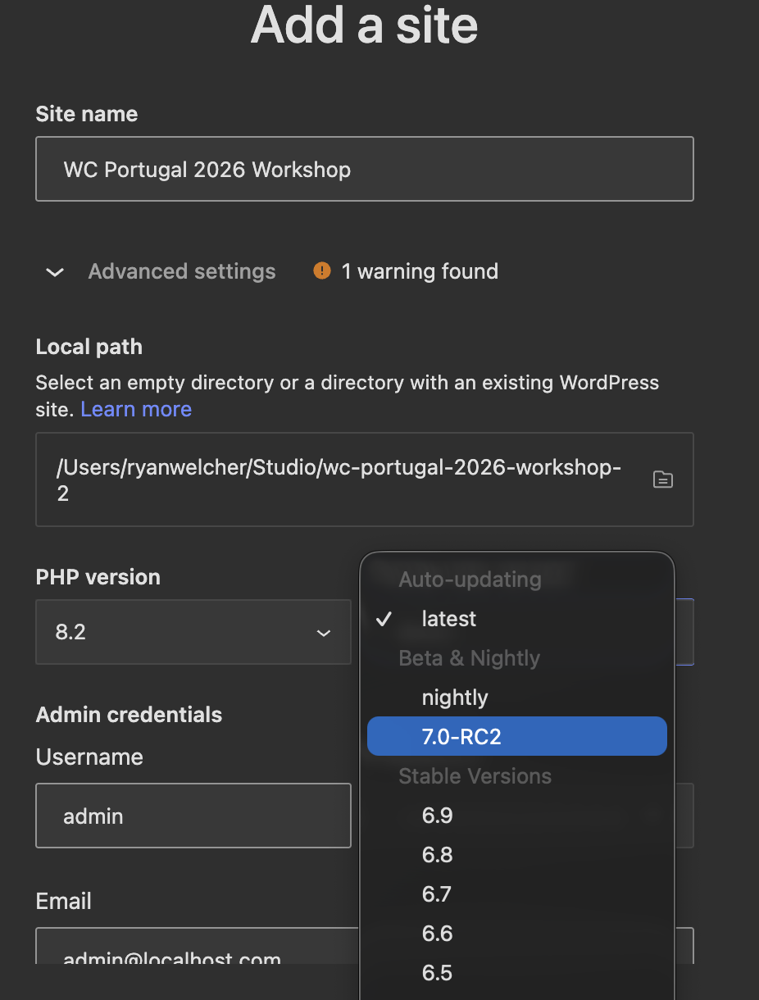

# Stop Doing It Yourself: Building AI-Powered Admin Tools with the WordPress AI API

### WordCamp Portugal 2026

**Presented by Ryan Welcher & JuanMa Garrido — Developer Advocates, Automattic**

## Pre-Workshop Setup Checklist

To avoid wifi bottlenecks on the day, please complete this **before you arrive**:

1. **WordPress Studio** — Download and install [WordPress Studio](https://developer.wordpress.com/studio/).

2. **Create a site from the blueprint** — Download the [`blueprint.json`](https://raw.githubusercontent.com/wptrainingteam/wcpt-2026-ai-workshop/trunk/blueprint.json) file from this repository. In Studio, click **Add site → Start from a blueprint → Choose blueprint file** and select the downloaded file.

   When the **Add a site** dialog appears, expand **Advanced settings** and set the WordPress version to **7.0-RC2** (listed under Beta & Nightly in the version dropdown). All other settings can be left as their defaults.

   

   > **Important:** The site will fail to be created if the WordPress version is not set to 7.0-RC2.

   Once the version is set, click **Add site**. Studio will install all required plugins and the workshop plugin with everything activated and ready to go.

3. **Node.js v20+** — Recommended via [NVM](https://github.com/nvm-sh/nvm):

   ```bash
   nvm install 20 && nvm use 20
   ```

4. **Install JS dependencies** in the workshop plugin directory:

   ```bash
   cd /path/to/your/studio/site/wp-content/plugins/wcpt-2026-ai-workshop-trunk
   npm install
   ```

   > Studio installs the plugin from `trunk.zip`, so the directory ends up named `wcpt-2026-ai-workshop-trunk` (with the `-trunk` suffix). Use that path here.

5. **Configure an API key** in your Studio site's WordPress admin under **Settings → Connectors**. Any of the following will work:
   - [Anthropic](https://console.anthropic.com/) (Text generation with Claude)
   - [OpenAI](https://platform.openai.com/) (Text and image generation with GPT and DALL·E)
   - [Google](https://aistudio.google.com/api-keys) (Text and image generation with Gemini and Imagen)

**Not using Studio?** For any other local WordPress installation you will need:

- **[WordPress Beta Tester](https://wordpress.org/plugins/wordpress-beta-tester/)** — install and activate it, then go to **Tools → Beta Testing** and switch to the WordPress 7.0 RC channel to update your site to 7.0 RC2.
- **[AI plugin](https://wordpress.org/plugins/ai/)** — install and activate from the WordPress plugin directory.
- **This workshop plugin** — clone the repo into your `wp-content/plugins/` directory and activate it:

  ```bash
  cd /path/to/your/site/wp-content/plugins/
  git clone https://github.com/wptrainingteam/wcpt-2026-ai-workshop
  cd wcpt-2026-ai-workshop
  npm install
  wp plugin activate wcpt-2026-ai-workshop
  ```

---

## Welcome!

Thanks for joining us today! We have 3.5 hours together — about 90 minutes of guided instruction, then a 2-hour hackathon. We'll move at a steady pace, but there's room for questions along the way.

## What Are We Building?

WordPress 7.0 RC2 brings together three AI building blocks for the first time:

- **PHP AI Client** — new in 7.0 core: a provider-agnostic PHP SDK for talking to AI models (`wp_ai_client_prompt()`)
- **Abilities API** — server-side PHP shipped in 6.9; the JavaScript client API (`@wordpress/abilities`) is new in 7.0
- **MCP support** — provided by the [`mcp-adapter`](https://github.com/WordPress/mcp-adapter) package (bundled with the AI plugin), which exposes registered abilities as MCP tools for agents like Claude and Cursor

We're going to build a simplified **Content Summarization** plugin from scratch. It's the same feature that ships in the official [WordPress/ai](https://github.com/WordPress/ai) reference plugin — stripped down so every line is understandable.

By the end of the guided section you will have:

- A WordPress plugin that connects to an AI provider
- A registered Ability callable via the REST API
- A block editor button that generates a summary and inserts it as a quote block at the top of the post

Then you'll have **2 hours** to build whatever you want using the same patterns.

## Structure

There are 5 guided sections (1 tour + 3 coding + 1 MCP demo) plus a 2-hour hackathon. Each section builds on the previous one.

The plugin in the repo root is intentionally a scaffold — empty `includes/` and `src/` directories with just a plugin header. You'll fill it in as the workshop progresses. If you fall behind or want a clean start, the `code-reference/` folders contain the complete state of the code at the end of each coding section.

> **Note on `code-reference/section-2/`:** this snapshot contains a temporary smoke-test function that Section 3 begins by deleting. If you copy section-2 forward as a starting point, remove `wcpt_test_ai_connection` (and its `add_action` call) before continuing.

**Section ↔ code-reference mapping:**

| Section                          | Code reference                | State                                  |
| -------------------------------- | ----------------------------- | -------------------------------------- |
| 1 — Tour AI Experiments Plugin   | _no code_                     | Exploration only                       |
| 2 — Scaffold + AI API            | `code-reference/section-2/`   | Plugin stub + smoke-test AI request    |
| 3 — Register the Ability         | `code-reference/section-3/`   | Ability registered, callable via REST  |
| 4 — Block Editor Integration     | `code-reference/section-4/`   | Complete plugin                        |
| 5 — MCP Demo                     | _no code_                     | Presenter-led demo                     |
| 6 — Hackathon                    | _self-directed_               | Build your own ability                 |

Let's go! → [Section 1: Tour the AI Experiments Plugin](./workshop-outline/section-1.md)
